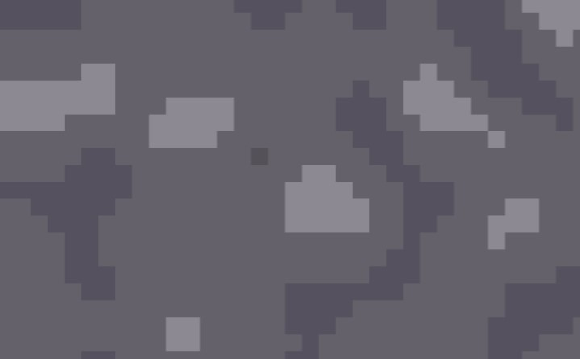
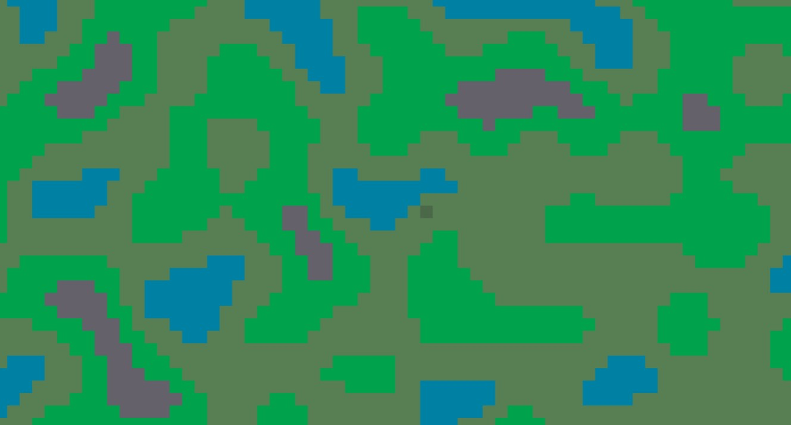
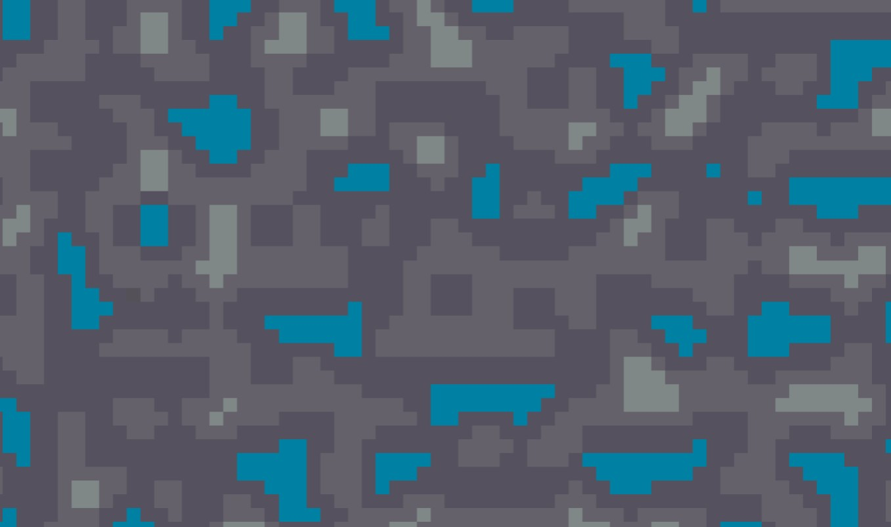
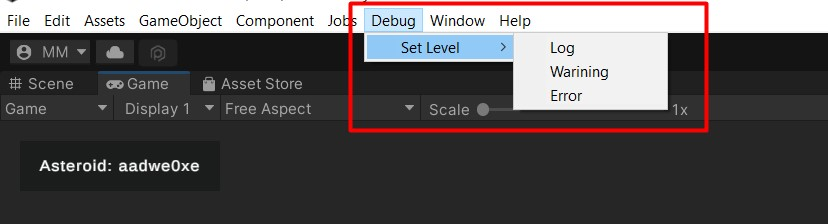

<div align="center">
    <h6 style="font-weight: 600;">5th Feb 2023<h6>
    <h1 style="font-weight: 700;">Update 1 - Terrain Generation & Rendering</h1>
    <h4>This update we look at generating terrain and rendering it. We have a look at a custom debug handler with in editor controls. As well as defining goals for the next update!<h4>
    <br>
</div>

## **Intro**

This marks the first two weeks of development on The Consortium, most of this time has been consumed by building out systems that will be leveraged and extended later and don't *do* much in isolation.

Firstly I spent a day or two updating software, reviewing old unity projects to review design patterns and such. I then set up the required unity project and got started.

I worked on generating and rendering terrain based on square tile blocks first. Added some simple camera controls to pan, zoom in and zoom out to traverse generated terrain. Added a tile controller to control any tile interaction, for now, this just highlights the tile as you scroll over, and logs the tile coordinates to the console when clicked. Next came the object system, which is a hierarchy of objects to hold the required data for the specific object such as terrain maps. The three defined celestial objects so far are Moon, Asteroid, and Planet.

After completing these I decided a log handler was required to control logging globally and extend Unity's logging system.

In the last few days, I have been putting together a basic UI system. That I will continue to extend and build out over the course of development.

<br>

## **Terrain Generation & Rendering**

This is where most of my time has been spent over the first couple of weeks as it is the core of the gameplay loop and will be reused in multiple places, hopefully, flexible enough to generate any kind of terrain required throughout the game.

### **Generation**

I decided to implement a system that defines terrain using [Perlin noise](https://en.wikipedia.org/wiki/Perlin_noise) as it will generate natural enough looking terrain maps. This may be changed or updated later as requirements present themselves but for now this does what is required.

Using the celestial object classes, mentioned in the intro, I am at a point where celestial objects own and generate their terrain maps from a range of defined parameters. For example, a Moon can be created and will generate a 2D integer map to define its own terrain, as well as storing that terrain for later retrieval, as well as owning and storing its valid tiles to render the terrain.

```cs
 private void runMoonCreation()
{
    ...
    var moon = GenerateMoon();
    RenderTerrain(moon._terrain, moon._terrainBlocks);
}
```
As you can see from the above a moon is created and then provides the required components for rendering from its initialization. Later the rendering will also be controlled through these classes.

### **Rendering**

Currently to render a map in-game the player needs to press "Z" key for an asteroid, "X" key for a planet, and "C" key for a moon. This currently creates the celestial object on the fly and immediately after renders it in the single Map game object as the centre of the scene. Below are examples of what these currently look like.

<div align="center">

<p style="font-style: italic;">Asteroid Terrain</p>


<p style="font-style: italic;">Planet Terrain</p>


<p style="font-style: italic;">Moon Terrain</p>

</div>

Rendering works by looping through the generated integer map and mapping the number to a tile from the objects tileset. Tilesets are defined by choosing valid tiles from a pool, below you can see what this looks like in code. 

```cs
 public void RenderTerrain(List<List<int>> terrainGrid, List<GameObject> prefabs)
{
    //Centre the map object
    var posX = terrainGrid.Count;
    var posY = terrainGrid.First().Count;
    gameObject.transform.position = new Vector3(-(posX / 2f), -(posY / 2f), 0);

    //Setup for tiles
    var uniqueTiles = terrainGrid.SelectMany(i => i).Distinct().OrderBy(x => x).ToList();
    CreateTileset(uniqueTiles, prefabs);
    CreateTileGroups();

    //Render tiles
    for (int x = 0; x < terrainGrid.Count; x++)
    {
        var row = terrainGrid[x];
        _tile_grid.Add(new List<GameObject>());
        for (int y = 0; y < row.Count; y++)
        {
            var tile = row[y];
            CreateTile(tile, x, y);
        }
    }
}

private void CreateTile(int tile_id, int x, int y)
{
    GameObject tile_prefab = _tileset[tile_id];
    GameObject tile_group = _tile_groups[tile_id];
    GameObject tile = Instantiate(tile_prefab, tile_group.transform);

    tile.name = string.Format("tile x/y : [{0}/{1}]", x, y);
    tile.transform.localPosition = new Vector3(x, y, 0);
    tile.AddComponent<BoxCollider2D>();
    tile.AddComponent<s_TileController>();

    _tile_grid[x].Add(tile);
}
```

I am happy with this system for now, generation needs more tiles to choose from to create proper depth and make it look more like real environments. Improvements to this system will be made as I progress with creating the gameplay loop.

<br>

## **Debug Handler**

I built out a debug handler that allows me to set the global level in the editor, for the set level the debug handler will only render logs of that importance and above. For example, if the debug level is set to Warning only Warning and Errors will be propagated.

This allows me to turn debugging on and off where needed in the editor and during gameplay. Below are the controls for doing that.

```cs
public static class LogHandler
{
    [MenuItem("Debug/Set Level/Log")]
    private static void DebugLevelLog()
    {
        setDebugLevel(DebugLevel.Log);
    }

    ...

    public static void setDebugLevel(DebugLevel level)
    {
        _debugLevel = level;
        Debug.Log(
            String.Format(
                "Debug level set to {0}",
                _debugLevel.ToString())
        );
    }
}
```
This allows debugging level to be set by code at any time or in the editor using custom menu controls. This is what that looks like in the editor.

<div align="center">
    
    <p style="font-style: italic;">In-Editor Custom Debug Menu</p>
</div>


Using this logger is easy as it is a static class with short and expressive method names, below you can see the static class needs to be included then `Log()` and other methods can be used to trigger log entries.

```cs
using static TheConsortium.s_LogHandler;

...

Log(
    string.Format(
        "{0} map generated, length: [{1}]", 
        GetType().Name, 
        terrainGrid.Count
    )
);

LogError("Error in SomeFunction() or whatever");
```


I will extend and add features to this as I go and it is required but this gives me the additional functionality I want for now. If you want to review the whole script or use it yourself you can find it [here](resources/s_LogHandler.cs).

<br>

## **What's next?**

I will continue to build out foundational systems and work towards a gameplay loop, focusing on spawning objects, exposing relevant values to UI and improving the celestial object system. I have spent lots of time in the last two weeks defining patterns for how things will work and refactoring as soon as I think something requires it, this will continue until I feel there is a solid definition of how systems work and interact with each other in intuitive and sensible ways.

**By the next update, the aim is to:**
 - Rendering controlled by celestial objects
 - Flesh out UI system, add more UI as required
 - Spawning system - spawn buildings on tiles
 - Improved tile interaction

 Thank you for reading, catch you next time, we will see what progress has been made. Have a great day!

