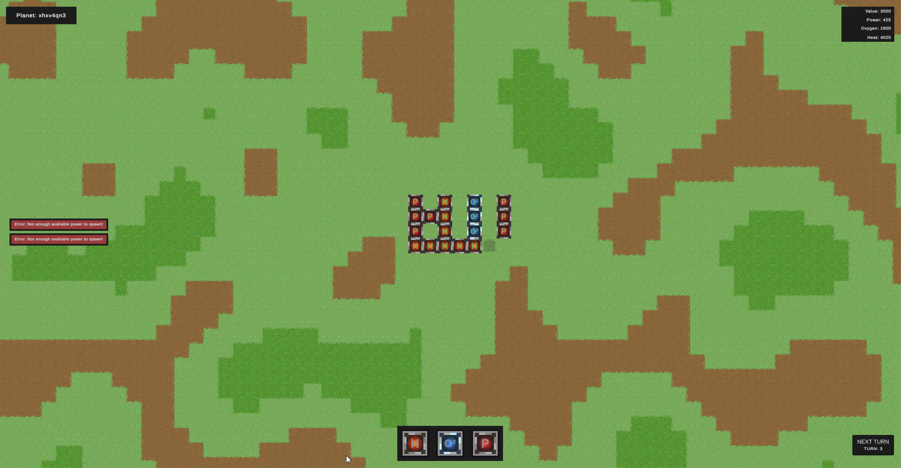

    <h6 style="font-weight: 600;">19th Feb 2023<h6>
    <h1 style="font-weight: 700;">Update 2 - Art, Turns, & UI</h1>
    <h4>The Consortium welcomes an artist to the team! We have been focusing on building up to a gameplay loop.<h4>
     

## **Review**
We have found an artist to work on The Consortium, and have spent much of the last week developing an art style and working towards a style for the game. This will be defined further going forward and much of the placeholder art being used will slowly be swapped out.

This fortnight we have done the majority of the work towards a gameplay loop. A turn system has been implemented. Buildings have been added and attributes for those buildings. A corresponding stats system that the attributes report to. The rendering of terrain has been moved to be controlled by the celestial object the terrain belongs to. A notifications system that can be pushed from anywhere has also been implemented. Most of these systems will be augmented and expanded upon as progress is made, but for now, they are doing what is required of them.

### What's been done?
 
 - [x] Flesh out UI system, add more UI as required
    * Turn UI
    * Stats UI
    * Building Hotbar UI
    * Notifications UI
 - [x] Rendering controlled by celestial objects
 - [x] Spawning system - spawn buildings on tiles
 - [x] Notification system
 - [x] Attributes system for buildings
 - [x] Turn system
 - [x] [Mood boards](/Moodboards/20230210_one/)
 - [x] Defined the required tiles for the artist
 - [x] First art for tiles 

### What was planned but not done? 
 - [] Improved tile interaction

### Why not?
Tile interaction work fell to the side as we shifted focus towards art and defining what was required to move forward to this, this is due to not expecting to have an artist on board this early.

 

## **Artwork**

We began to work on art in the last half of this fortnight, initially beginning with [Mood boarding](/Moodboards/20230210_one/). Once we felt we were all looking through the same lens we began to spend some time defining the first batch of tile types.

Tile Definitions

Once we had defined the tiles we began to work towards defining an art style for the game through the use of the [mood board](/Moodboards/20230210_one/) and experimentation. We are yet to come to a concrete style and are still experimenting and will continue to do so over the next fortnight.

We are currently experimenting with some animated tiles and styles but have run into some issues with performance, from the investigation done so far we should be able to overcome the issues, however, we plan to offer the option to turn these off and use static tiles for lower powered hardware.

Grass Tile Comparison

Grass Tile Set For Animated Grass Tests

We will continue to develop the art style and work on integrating the art into the game as soon as it is ready. We hope to show a more cohesive and interesting art style as we go.

 

## **Turns, buildings, attributes, and Stats**

Most of the technical effort has been focused on building the required system to have a gameplay loop to play with and start testing the game as early as possible.

This has led to a turn system being implemented, this currently is as simple as increasing the turn number and invoking a delegate function that allows any other system to hook into the turn and complete any action required.

The first basic Buildings (or "spawnable items") have been added. These can be selected from a hotbar on UI and have attributes attached that describe the functions of each one. For example, the power building produces 250w of power, consumes -25W of that power, produces +25 heat per turn, and has a value of 300.

The attribute system is built in a way to have flat value attributes and cumulative value attributes. Flat values don't change, for example, a power station will always produce +225W of power for use. However, cumulative attributes will add to the overall corresponding stat, for example, a heater produces +250 heat every turn from the point it is active (currently the same as being placed).

The attributes can block buildings from being built if doing so would drop any stat below its minimum value. For example, you can't place a heater without a power station or with less than +150W of available power as this is what it requires to function. When this occurs the newly built notifications system is leveraged to notify the player.

All Together Now - A screenshot of the current game window.

The stats system is a way to track the current state of any celestial object and should also accommodate the need for global stats later, as it is built to be portable and self-contained. Currently, this system works by registering stats with a controller that is owned by the celestial object. All control and communication is done through the controller that registers and holds the stats for the celestial object.

Attributes register and report to the stats system using delegate functions, through the controller. The stats system reports and updates a corresponding UI for the player to have visibility.

 

\* *This system may change as development moves forward, as needs emerge and shift.*

\* *All of the attribute values discussed are for testing and will change as buildings are defined.*
 

## **What's next?**

The time to work over the next fortnight will be reduced to one week as the team are on going on holiday. However, we still aim to develop the art style further and implement more art, as well as solve the performance issues we are experiencing with animations. As well as working on the "boring work" of filling in spreadsheets to define buildings, their attributes, and resources. Doing so is in the name of working towards a playable game and gameplay loop, this will likely consume much of the time we have.

**By the next update, the aim is to:**
 - Expand attributes
 - Define buildings and resources
 - Continue to define art style and implement art
 - Performance optimization for animated art

 Thank you for reading, we will be back in two weeks to rant at you again. See you then, Have a great day!
