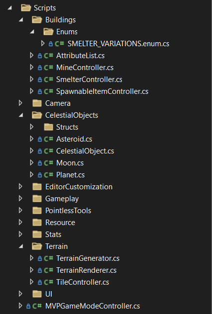
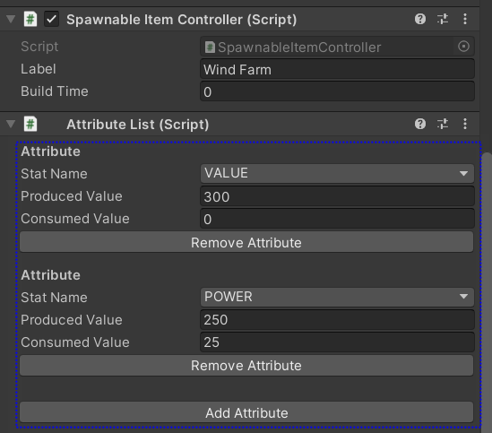
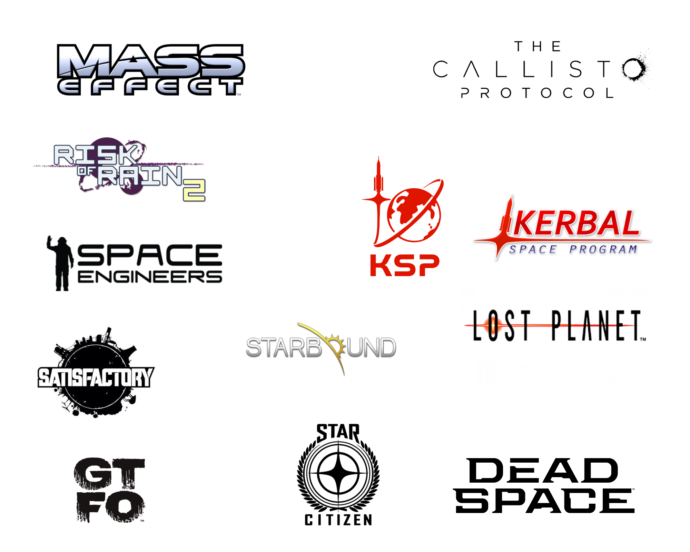
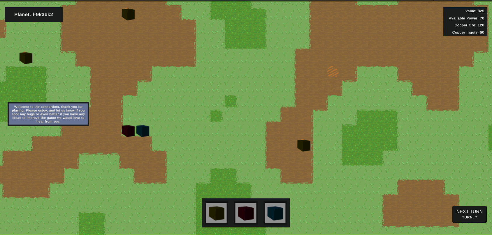

    <h6 style="font-weight: 600;">5th Mar 2023<h6>
    <h1 style="font-weight: 700;">Update 3 - Refactoring, Logo & Buildings</h1>
    <h4>The Consortium makes moves to acquire its logo. We have otherwise been focused on defining and starting to build out various gameplay elements.<h4>
     

## **Review**
Having only one of the last two weeks to work on The Consortium we will have a shorter update this time. Most of the effort has gone into setting up and filling in many different spreadsheets to define buildings, attributes, resources, and stats. We continue to work on defining these various bits.

Alongside we have started to implement selected items from here to inform what is needed, and what feels logical, and to explore and help define the technical systems required to implement these. Other than that we have been refactoring much of the code for various reasons discussed below.

Overall there are a lot of things on the list but many of them remain in progress and others took little time but were required or logical.  

### What's been done?
 
 - [x] Refactor codebase
    * Group script into logical components
    * Each component group has its own namespace
    * Removing unused references in scripts
    * Enums & structs in own files
    * Moving enums & struts into subfolders
    * Remove "s_" script prefix
 - [x] Refactor Attributes
    * Create a building controller
    * Building controller owns attributes
    * Move attribute-stat controllers to be in building controller
    * Custom unity editor UI for attribute lists
    * Require the attribute list to be included when adding a building controller
 - [x] Resource node - Copper
 - [x] Mine building
 - [x] Smelter building
 - [x] Wind turbine power building
 - [x] Expand attributes
 - [x] Define buildings and resources
 - [x] Continue to define art style and implement art
 - [x] Logo moodboard
 - [x] Logo development

### What was planned but still needs to be done?
 - [ ] Performance optimization for animated art

#### Why was it not completed?
The route cause was found, and the issue has been shelved as we are confident it is fixable. We are focusing on static art for the time being for performance optimization, we will be exploring animated terrain tiles going into the future for higher fidelity options, but we will always need a static option for lower-performance hardware, so this is where we are choosing to focus our time and energy at this stage of development.

 

## **Refactoring**

I know what you may be thinking.

Refactoring? This early in development?

Yes, most of this refactoring is due to the nature of developing an MVP, we are much more interested in testing ideas out and getting things working than we are on code quality and best practices. However, we don't want to end up in a place where we need to refactor hundred of systems, structures, and scripts all at once. So let's have a look at what we have done...

### Codebase

Codebase structure was never defined at the start of the project we read and watched various things advising this structure or that one for one reason or another. We ultimately decided to ignore all of them but keep them in mind, and when it felt right we would refactor to a structure that made the most sense. Now felt like that time. So, we found the most logical structure would be to group scripts by logical groups such as "Stats", "Camera", "Buildings", and "PointlessTools" (pointless is the studio the game is being made under).

Once this was in place it made sense to make sure all structs and enums were in their own files and lived in subfolders named "Structs" & "Enums" respectively within their logical groupings.

Once everything had its new home we updated namespaces to match their new location, all the scripts inside the "Stats" folder has the same respective namespace: "TheConsortium.Stats".

Folder structure after refactoring.

Various other smaller changes were made; we decided the prefix ("s_") being used for scripts in the project was unnecessary and made it harder to scan files, so it was removed. We cleaned up any unused references in script files and grouped them.

### Attributes

This system was refactored to be more flexible and allow for various mechanics such as build time to be possible. We also got to explore how to make custom Unity editor UI for custom lists and how that can work. We anticipate this will be much more flexible and fulfil the needs of the system much better as we progress.  

Custom editor UI for attribute lists.

We also designed the system so that when a spawnable item controller is added to a building (or any game object) it will automatically add an attribute list as well. This is partly because it requires it but more to save effort.

\* *If you would like to learn about custom Unity editor UI see [this post](https://forum.unity.com/threads/display-a-list-class-with-a-custom-editor-script.227847/). Don't tell anyone but we more or less copied it and simplified it for our needs, so thanks ForceX!*

 

## **Art - Logo**

We decided to distract our newly onboarded artist with some logo work. We have decided to focus on this so we can begin to work on marketing the game slowly and as early as is possible in various ways. To do that the game needs an identity and we feel a logo is a large part of that identity.

The Consortium logo moodboard.

While developing the logo we have found it has helped to define our art style and the overall feel of the game. We are not yet at a point where we have a completed logo but progress has been moving along well, and should be in a place to share and talk about it next week. So for now enjoy the moodboard we created.

 

## **Resources & Buildings**

Most of this work has only just started in the last few days and continues to progress. So we expect this to change and develop a lot in the next few weeks. As part of beginning to implement the various things defined we have removed the old temporary buildings and created a singular new placeholder building sprite that we will use for everything until the art is created for them.

Game screenshot, not much has changed visually minus buildings and resource node indicators (the orange-ish slashes).
Tinted buildings: red - power, yellow - mine, blue - smelter.

The resource nodes are placed on the terrain as part of the rendering as a quick temporary way to get these in, later resource node placement will be integrated into the terrain generation and therefore not change—currently, the only resource node implemented is for copper ore.

We have implemented a basic mining building this can only be placed on tiles with resource nodes and will extract 30 ore for normal nodes and 60 ore for pure nodes. Pure nodes are currently not implemented but are planned to be only a 3-10% chance for each node.

The next logical step from the list of defined buildings was a smelter so we began to to implement this using the attribute and stats system hoping we could handle resources and stats through the same system. This works to a particular degree but due to different needs and restrictions, we have decided the two systems will need to be separated. This is the next task to work through for us, create a separate resource system to handle resources and building input/outputs.

We also replaced the original power building with a wind farm power station variation that is currently planned to be our first-tier power building, this is because we want to retain the functionality where placing a building requires power. That's all for now on that.

 

## **What's next?**

As stated above our next step is to implement the resource system to handle the buildings we are putting together. We will continue to progress with the logo and should have that to show off by the time the next one comes around. Sprite art should slowly start to feed in as the logo work comes to an end, we are looking forward to that.

We will also start to look at marketing and what we need to support that effectively going forward, as we attempt to build a community around the game and studio.

There is also a range of project management tasks and things to complete, but that's dry so we will try to avoid talking too much about it.

**By the next update, the aim is to:**
 - [ ] Build out a resource system
 - [ ] Continue to expand the definitions for building, resources, resource nodes, and stats
 - [ ] Implement more buildings, resources, resource nodes, and stats
 - [ ] Start to look at a webpage, marketing, and setup social media
 - [ ] Art: terrain tiles, buildings, and logos
 - [ ] UI: labels, improve selected building UI, title screen, resources

 It was a pleasure to have your attention, thank you. We will be back in two weeks to provide another enlightening update. See you then, and have fun in the interim!

