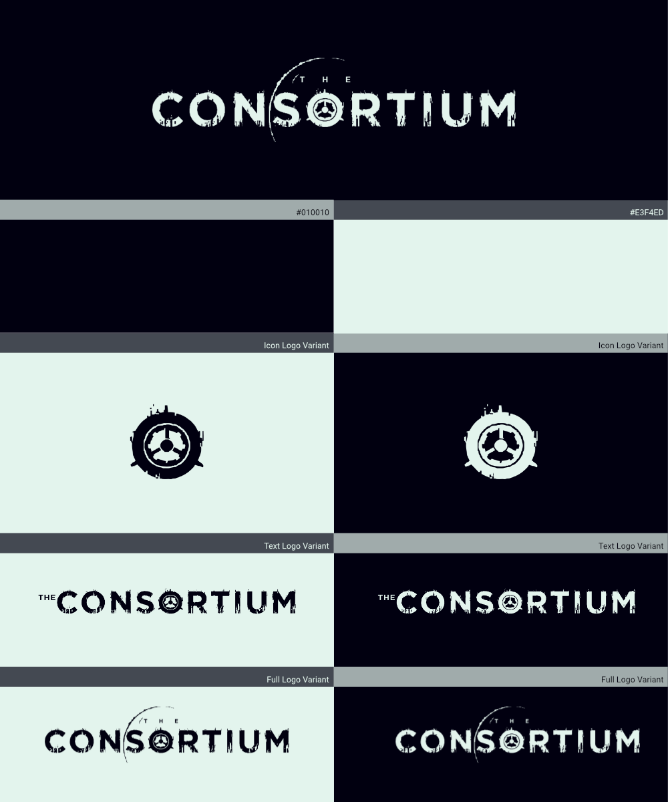
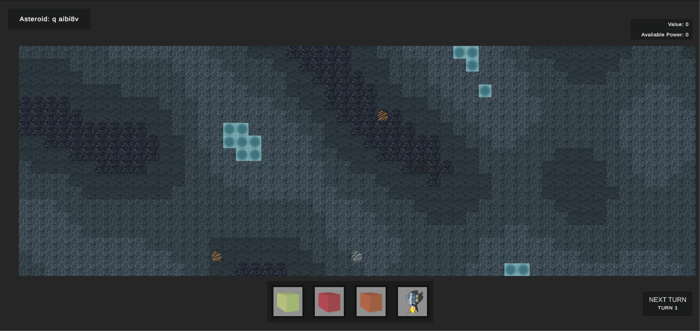
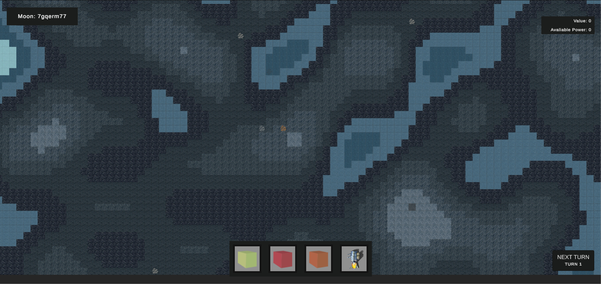
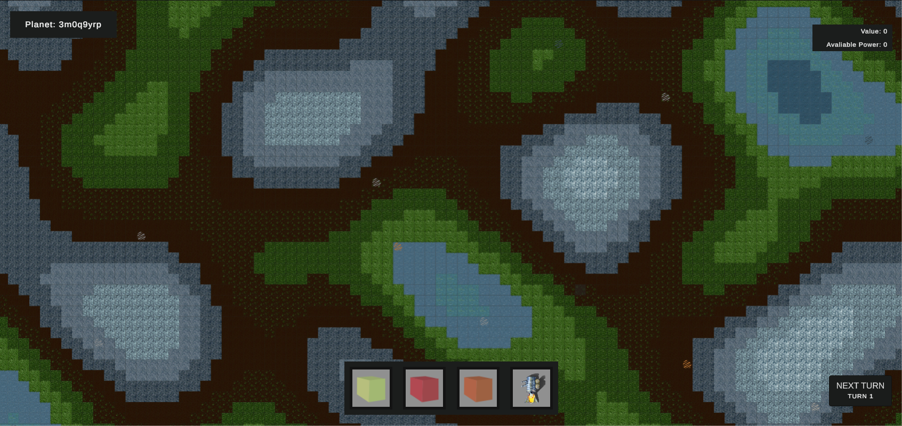

    <h6 style="font-weight: 600;">21st Mar 2023<h6>
    <h1 style="font-weight: 700;">Update 4 - Game Logo, Resource Management, & In-Game Art</h1>
    <h4>The Consortium now has a logo! A new resource management system and plenty of new in-game art.<h4>
     

## **Review**
We have completed a lot in the last two weeks and simultaneously not as much as we wanted, overall content with the progress though. We have a logo, we have a new resource system and loads of new game art. We have also changed the overall game idea and cut some ideas to refine the game overall, we will discuss it all below, let's jump in.

### What's been done?
 - [x] Build out a resource system
 - [x] Continue to expand the definitions for building, resources, resource nodes, and stats
 - [x] Implement Smelter (All variations to account for preview rotation)
 - [x] Create preview functionality for buildings
 - [x] Develop functionality to rotate preview buildings
 - [x] Altered map generation to produce smoother landscapes
 - [x] Art:
    * Logo, Variations & Presentation
    * Sand Tiles (3 Variations)
    * Water Tiles (4 Variations)
    * Rock Tiles (7 Variations)
    * Grass Tiles (5 Variations)
    * Ice Tiles (4 Variations)
    * Smelter (4 Variations & Holo Animated version for preview)
    * Animated Holographic Smelter version for preview

### What was planned but still needs to be done?
 - [ ] UI: labels, improve selected building UI, title screen, resources
 - [ ] Start to look at a webpage, marketing, and set up social media

#### Why was it not completed?
Unfortunately one of the team has been unwell for the last week or so and this has caused the work to slow down for most of this time, these things will be addressed next and should be part of the next update!

 

## **Game Logo**

The Consortium team finished work on the games logo, we are incredibly proud and happy with the results so we hope you love it as much as we do! We created three variations of the logo to be used in different mediums and contexts, all three are shown below. Without further ado, we present The Consortium logo.

The Consortium Game Logo Presentation

That's all we will say on that, expect to see it crop up everywhere going into the future!
 

## **Development Update**

Most of the development effort has gone towards implementing various functions and tools for art assets, as we are currently iterating very fast on this front to define the games identity and get a cohesive art style. We will show you what's been done for this in the "Art Update" below.

That being said we have implemented a new resource management system to handle the resources in the game, a lot of what previously was in stats will be transferred over to this as that is where it logically should live. Power is a resource, not a statistic, the stats system has been retained and will be used, likely slightly modified as well in order to provide statistics for the current game state.

Currently, the system is already handling various ores and ingots. As well as providing the functionality to both the smelter and coal power station to perform the actions they are designed to carry out. The smelter turns ores into ingots and the power station turns coal into power.

We intend to add a UI for this as currently none of this is exposed to the player, this should be part of the next dev log.

 

## **Art Update**

We have been very busy on the visual side of the game creating multiple new tiles for terrain generation across all celestial object types. We are still in the throws of nailing the style but we are getting closer every day on that front. The whole process is really helping us to refine the game, let's have a look at what we have so far and we will talk about where we plan on going as we have decided we are going to make some changes.

Asteroid Terrain Screenshot

We have completely changed the tile set for the asteroids, implementing these blue-ish rocks at various brightnesses to create the feel of elevation as well as introducing small amounts of ice.

Moon Terrain Screenshot

We have done the same for the moon tile sets and mostly used the same assets though due to these being larger areas they have access to a larger range of rock tiles to provide more overall depth, as well as more ice overall for now.

Planet Terrain Screenshot

Planets have much larger and more dynamic tile-sets currently, to produce a more dynamic terrain as would be expected on a planet. However, while implementing these tile sets and doing the supporting work to make them look right it occurred to us that it doesn't logically make much sense for The Consortium as a company to be invested in Science Research And Terraforming projects across the galaxy.

As a result, we have decided to refine the games scape overall and head in a slightly different direction

 

## **A Different Direction**

The original idea of The Consortium was to have a corporate entity known only as "The Consortium" which was a group of businesses that exited for one reason; to profit. We also planned to have this entity be heavily invested in terraforming projects as well as scientific research projects so much so the plan was to have the player start by doing a contract for The Consortium to complete a terraforming project on their behalf.

After walking through the gameplay loop and overall tone of the game it didn't make much sense, so we have decided we are not going to continue in that direction and make The Consortium very much about what they were always intended to be a grey area space fairing super-conglomerate that run around extracting and refining every resource they can get their grubby hands on with no concern for the universe.

This won't change the plan or vision of the game, we believe it refines the vision, tightens up the scope and produces a stronger identity to build a universe around. We are still building the same game but with different technologies and focuses. Players will now be launched into a similar situation as planned with the terraforming project at the start but the context will be changed, they will now be running a mining colony that has various goals and demands to meet from The Consortium.

We will be rewriting the outline and hopefully expanding it over the next two weeks to fit this pivot and provide more detail about the universe we are attempting to build!

 

## **What's next?**

First, we will nail the changes to the game's context and use that to help us refine our various building definitions and tile sets. We expect the game to change visually quite a lot again in the next two weeks so we can't wait to show you what we come up with.

Unfortunately due to illnesses, we haven't had time to properly plan and outline the next couple of weeks for ourselves before writing this, so we can't give as full a picture as we normally would like. However, let's see what we do have...

**By the next update, the aim is to:**
 - [ ] Rewrite and expand the game outline
 - [ ] UI: labels, improve selected building UI, title screen, resources
 - [ ] Settings UI and system
 - [ ] Define new tile sets, buildings around changes
 - [ ] Design and implement new tiles, buildings, and resources
 - [ ] Start to look at a webpage, marketing, and set up social media

 Thank you for reading. We will be back in two weeks to provide another enriching update. See you then, and remember to enjoy life!

