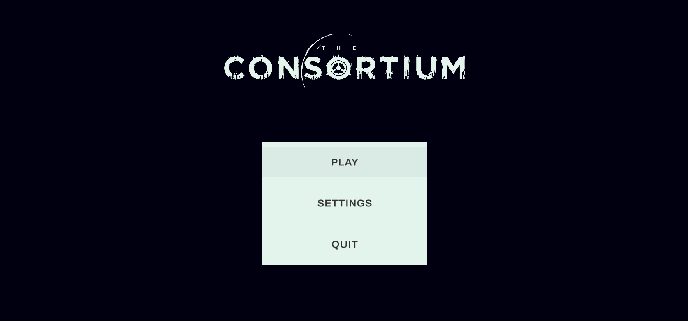
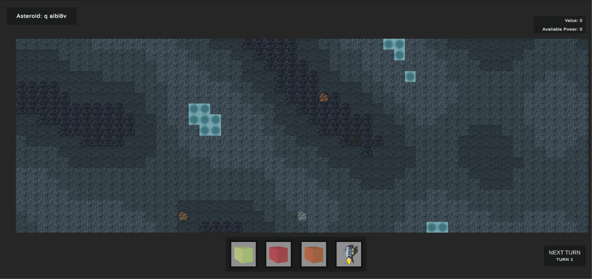
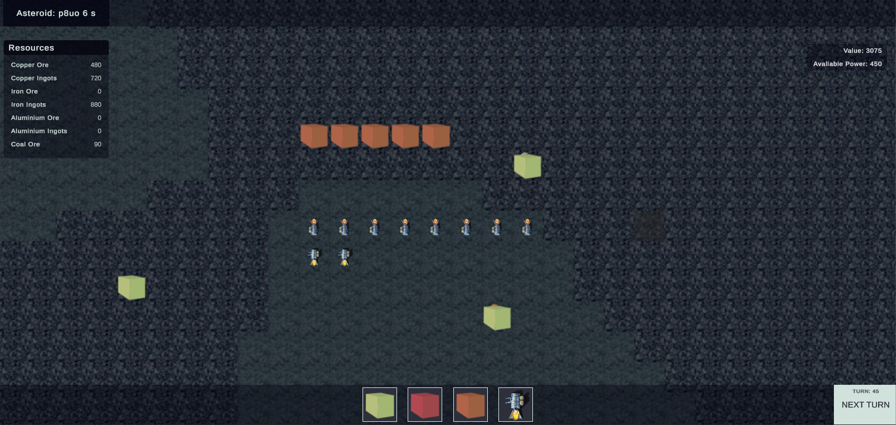

    <h6 style="font-weight: 600;">3rd April 2023<h6>
    <h1 style="font-weight: 700;">Update 5 - Growing Pains</h1>
    <h4>A look into how we are learning to manage, work, and collaborate on a large creative project. Also some UI work and a new input system.<h4>
     

## **Growing Pains**
As we have been focusing on the development of the game for the last couple of months, a small pile of work surrounding the game had begun to pile up. While discussing various assets for the game such as tiles and buildings it became apparent not everyone on the team was quite on the same page, mostly due to never being handed the book in the first place.

Once having this conversation it became obvious we must address these before we continue into development, as well as improve how we work, and prepare for the future. As a result, this development log will be a little different; about how we are addressing these gaps more than the development progress. After this section the usual update is available, should you want to skip there.

As discussed last update our first task was to update the [game outline](/GAME_OUTLINE.MD), as we have slightly tightened the scope of the game up to remove the terraforming aspects and any do-gooding that might have existed, this is due to narrative fit and overall game scope. We felt that the universe we were building, and especially The Consortium's place in that universe, didn't have room for caring about much at all, especially human life and the quality of said life. The terraforming aspect muddied the water on The Consortium's identity, having no real logical answer for it made growing perfect worlds for humans something that made sense to remove.

Removing the terraforming also simplified the game design overall, as well as reduced the scope of development. This also made sense for us as we are new to developing projects of this size as a small team and this is the first time we have managed everything for a project of this scale. We welcome the challenge but we want to keep our goals within the realm of achievability and the release date inside this decade. The tech tree(s), buildings, and environments have all changed as a result, they have become easier to define. This change has overall been positive, it feels like a step in the right direction of getting everyone on the same page.

The [game outline](/GAME_OUTLINE.MD) is now also better written and more thought out, we attempted to take the player on more of a journey through our planned gameplay loop and explain the challenges that will be presented in broad strokes. Trying to weave some world-building throughout so you can get an idea of the universe it is all set in and The Consortium's place, scale, and power within it. We hope this is reflected in the new outline.

Next in the march towards the same page, we reviewed how we were defining buildings and their purpose. Previously we have been defining buildings in a spreadsheet with various columns to define various attributes, it made little sense to anyone other than those who already understood the full scope of the game and narrative, it was fairly useless for anyone else. To address this we defined the buildings required to get a colony to be self-sustaining in a simple word document with text descriptions, explaining what they require to function, what they output and the purpose of the building. This illustrated the inter-dependency of each building and how they made sense in a simple format, it clarified the gameplay loop, and what the player will do for everyone on the team.

We plan to use these new building descriptions to start a new spreadsheet for the purposes of defining all the technical requirements to implement into the game and create art while continuing to use the text descriptions to give the context of its place in the colonies. A new spreadsheet is required as we found while working through this we also changed some buildings, combined others and overall just refined them.

We will continue to work like this going forward and plan to use this as a blueprint for the next iteration of buildings for players to progress to stage 2 of the contract, and again for the final stage, and so on. This is how we plan to define our buildings throughout, reviewing any previous buildings as we iterate to keep everything balanced, in terms of resources having uses and players being able to acquire what they will need.

Third and finally for this update on landing everyone on the same page, we have decided to go back to basics on the art side and develop some further mood boards for various, more specific, aspects of the game. We plan on creating four new mood boards: Buildings, Character, Environment, and CONTROL Base. These are all in an effort to refine the art style, explore new ideas, and find new perspectives for these aspects of the game. We are not yet in a place to show these, though we have completed some, we want to present both these and the follow-up concept art that is planned together in a future update.

A Moodboard for CONTROL Base is to communicate the idea of what we want it to look like between us, but also as a visual reference to a larger context as we struggled to find anything exactly like what we wanted visually. This mood board will be used to create concept art that will be used on our webpage, in-game, and as promotional material, as we have chosen to make it the centrepiece of our identity incorporating its silhouette into our logo.

The buildings and environments mood boards are to assist with the creation of game assets directly and add to the overall world-building in order to communicate the vision of the game better. These are the assets we have been actively working on for a while and as a team have been unsatisfied with the overall results, we have tried a few ideas and we haven't felt like we were progressing in the right direction. This is an effort to address that by injecting new ideas, allowing us to re-assess how we thought about the buildings and the environments they will exist in and providing a visual aid to the context we defined in the previous step. These will also have concept art that will be used to promote the game but more so they are there to verify we are on the same page, and talking the same language.

The character’s mood board is for similar reasons as the buildings and environments but it is not something we are currently working on. We will in the future have characters in the game and both the mood board and concept art will be highly useful we believe. Characters are a reflection of their environments so we believe this in particular will assist us in refining and defining our art style, building our world and once again making sure we are all reading off the same song sheet. They also make for some great art to show everyone, so these too will be used to promote the game.

As for the aforementioned small pile of other work, well it is mostly project management work. We have done a few things that have been rather time-consuming but have proven worth the time in the last couple of weeks. We moved to Trello to manage this project, pointless studio (the company), and another project we are in the throws of setting up. This instantly made it easier to manage and see where we were with everything and know what everyone was working on. In short, it made collaborating easier.

In moving we also took the opportunity to flesh out and add many tasks that were in people's heads or on individual task lists. This was great for getting a better feel of where we are at and where we are going and roughly how fast we might be able to achieve that. We now have a very full task list for The Consortium. A rather respectable one for Pointless Studio. Finally a small but growing one for our new project.

Doing this addressed all of the current pain points we were having with project management for now, we know Trello might not be the best tool as we scale into a larger studio but we want to right-size our tools. Trello feels like the right size for us right now, it's flexible, simple, and intuitive.

The new project is something we plan on putting The Consortium down to work on for the summer period, we plan on doing this for many reasons. First, we want to tackle a smaller project with a tight scope. Secondly, we feel we can learn a lot about how to manage projects and marketing games, improving both sides for The Consortium and the studio overall. Thirdly we want to ship, we want games out there that people are playing, giving us feedback and helping us improve at making games, releasing games and managing a community around those games. Finally, we are doing this because it has been our plan from the start, in an effort to improve our craft.

That is all we have to say about the growing pains that come with attempting to forge a studio and build games. Hope this provides some insight into what it is like to build something complex with other people, it isn't straightforward, that is for sure. That being said we are thoroughly enjoying the challenge, and continue to blast ahead.

## **Development Update**
We have mostly worked on UI in the game over the last two weeks, we have started to give it some shape and have improved the design a little. This is not our final UI by any stretch, however, we feel it is an improvement that works for now.

Unity's "new" input system has been added to the game to handle the... input. This means keyboards, mice, game controllers, joysticks and all that stuff.

### What's been done?
 - [x] Rewrite and expand the game outline
 - [x] UI: labels, improve selected building UI, title screen, resources
 - [x] Input system
 - [x] Main Menu
 - [x] Define new tile sets, buildings around changes

### What was planned but still needs to be done?
 - [ ] UI: Settings menu
 - [ ] Design and implement new tiles, buildings, and resources
 - [ ] Start to look at a webpage, marketing, and set up social media

#### Why was it not completed?
Other tasks took longer than planned to complete, our change of tooling and shift of scope shook up our time and as a result, we were not able to get to these. They are still planned and should be in the next update, however, concept art will come before assets for "tiles, buildings and resources" so that depends on the rate we complete the concept art.

 

## **User Interface**

We created a Main Menu for the game, this was in an effort towards getting to a playable game and it made sense that as we worked on resolving some build issues and moving towards having a working build we had a menu greet the player rather than a game scene. Luckily we have our logo that has done most of the work in making the menu look presentable, without further ado a main menu for you to gaze upon...

The Consortium UI - Main Menu

The Consortium UI - In Game Old

We have also spent time putting together the in-game UI in order to make it hang together better, look better and make more sense. As we previously had a bunch of floating boxes with various bits of information rendered in them. We have also added a resource management panel to bring the quantity details of resources to the surface where the player can see them, this also helps us keep an eye on the numbers for simple testing. We have used the logo colour pallet to drive the new design and we feel this helps to tie everything together visually a little more improving the overall experience. Above is the old in-game interface, below is the new interface for comparison.

The Consortium UI - In Game New

 

## **Input System**

We implemented unity's "new" input system, this has a lot more moving parts than the "old" built-in input manager, and a lot more set-up is involved. However, it reaps rewards in its more modern approach to input management and its design patterns. It's doubtful we will use it to its full potential, but the separation it allows for different devices and the ability to key-map at run-time makes it worthwhile alone.

There isn't much else to say or show on this for now, it will be a part of the solution for our settings menus allowing players to create custom keymaps. We plan on tackling that in the next couple of weeks so we will continue with this subject next time.

\* *[This blog post](https://gamedevbeginner.com/input-in-unity-made-easy-complete-guide-to-the-new-system/) was a great all-rounder for getting to grips with the input system, should you want such knowledge.*

 

## **What's next?**

We are working to complete the mood boards and will move on to concept art for each of these specific areas, which we expect will take up much of the art time for the next couple of weeks.

Development side we will be looking at implementing the buildings we have defined for stage one of the contract and after moving them into an appropriate format to define all of their attributes and requirements. 

Firstly we will be looking at the drop pod for new colonies that will provide some base resources to players. From there we will logically work our way through buildings in the order that makes the most logical sense with the lens of getting to an enjoyable gameplay loop. All the buildings for stage one are deemed to be required for a colony to self-sustain so we will be working to implement them as soon as we can. 

User interface work will continue as we aim to implement a settings UI with control mapping. 

Currently there are some errors when trying to build, stopping us from creating a stand-alone application, we plan to address these in the next two weeks also.

We will finally be starting to work on marketing, website pages and the such for the game and studio.

**By the next update, the aim is to:**
 - [ ] UI: Settings menu
 - [ ] Design and implement new tiles, buildings, and resources
 - [ ] Start to look at a webpage, marketing, and set up social media
 - [ ] Fix Build Errors
 - [ ] Implement building: Drop Pod
 - [ ] Implement building: Solar Array
 - [ ] Implement building: Habitat Module
 - [ ] Implement building: Water Pump & Treatment Module
 - [ ] Implement building: Oxygen Module

 Thank you for reading, it was great having you for all this time, hope you have a productive couple of weeks and we will see you again then!

