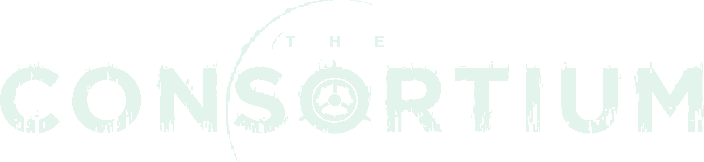

    
    <h3 style="font-weight: 700;">Development Log</h3>
    

        Development log and information hub for a 2D top-down futuristic turn-based colony simulator, resource management and automation game built in unity. 
    

## **Development Logs**

- [Update 1 - Terrain Generation & Rendering](/DevelopmentLogs/20230205_Blog_1/terrain_generation_rendering.md)
- [Update 2 - Art, Turns, & UI](/DevelopmentLogs/20230219_Blog_2/art_turns_ui.md)
- [Update 3 - Refactoring, Logo & Buildings](/DevelopmentLogs/20230305_Blog_3/refactoring_logo_buildings.md)
- [Update 4 - Game Logo, Resource Management, & In-Game Art](/DevelopmentLogs/20230321_Blog_4/logo_resources_tiles.md)

### **Want to learn more?** 

[The Consortium game outline](GAME_OUTLINE.MD)

[Logo Moodboard](/Moodboards/20230302_logo/20230302_logo_moodboard.png)

Game Moodboard:
- [Part 1](/Moodboards/20230210_one/20230210_moodboard_one_part1.png) 
- [Part 2](/Moodboards/20230210_one/20230210_moodboard_one_part2.png) 
- [Part 3](/Moodboards/20230210_one/20230210_moodboard_one_part3.png)

 

